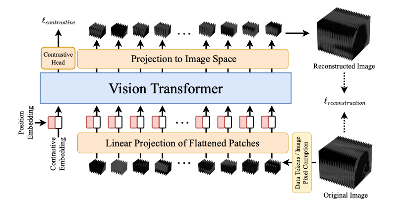

# SiT (Self-supervised vIsion Transformer) for Volumetric Medical Data

This project is an adaptation and training of the SiT model, originally developed by [Sara Atito, Muhammad Awais, and Josef Kittler](https://github.com/Sara-Ahmed/SiT). The original repository provides a foundation for this project, and we have made modifications to suit our specific needs.

Link to the original repository: [Original Repository](https://github.com/Sara-Ahmed/SiT)
</br>Link to the paper: [Paper](https://arxiv.org/abs/2104.03602)

## Objective

In this project, our objective is to adapt and train a self-supervised vision transformer (SiT) for volumetric medical imaging. Leveraging a dataset of 3D CT scans, we aim to harness the power of vision transformers coupled with self-supervised learning (SSL) to learn a meaningful representation of the data. This learned representation can then be utilized to assess the quality of generated medical image data by measuring the distance between synthetic and real volumes in the learned feature space. By doing so, we hope to overcome the limitations of traditional evaluation metrics and provide a more reliable and domain-specific assessment of the generated medical images.

## Data 
For this study, we used data from the Lung Image Database Consortium (LIDC) Collection, hosted within the IDC repository. The LIDC database contains spiral CT lung scans with marked-up annotations of lesions, specifically designed to aid research on lung cancer detection and diagnosis.
The Imaging Data Commons (IDC) serves as a data repository and platform for sharing cancer imaging data, created as part of the Cancer Research Data Commons (CRDC) initiative by the National Cancer Institute (NCI) in the United States.

Data Source: [NCI Imaging Data Commons](https://aacrjournals.org/cancerres/article/81/16/4188/670283/NCI-Imaging-Data-CommonsNCI-Imaging-Data-Commons)





# Requirements
```
conda create -n SiT python=3.8 # create environment
conda activate SiT # Activate the environment and install the necessary packages
conda install pytorch torchvision torchaudio cudatoolkit=11.0 -c pytorch
pip install -r requirements.txt
```
# Steps to Run the Code

## Prepare the Data
Follow the steps below to successfully run the code in this repository:

- Download the data by referring to the instructions provided in the [`download_data.ipynb`](./download_data.ipynb) notebook.
- In short:
  - `docker pull peakcom/s5cmd`
  - `docker run -rm -v /where/to/download/to/locally:/aws -v ~/.aws:/root/.aws -v $(pwd):/app /s5cmd run /app/cohort_1076_20230617_24853_gcs.s5cmd`
- Of course, replace `/where/to/download/to/locally` with an existing path on your machine.

- Clean the file structure of the downloaded data. We want it to be in the folder structure `PatientID-StudyInstanceUID-SeriesInstanceUID-SOPInstanceUID`
```
git clone https://github.com/pieper/dicomsort.git
pip install pydicom
python dicomsort/dicomsort.py -u dicom_files_dir cohort_sorted/%PatientID/%StudyInstanceUID/%SeriesInstanceUID/%SOPInstanceUID.dcm
```
- **Note:** Replace `dicom_files_dir` with the directory of saved dicom files.

- Convert the DICOM files into compressed NumPy arrays. There are two possible methods you can use:
  - **MeVisLab:** Using the [`network_final.mlab`](./network_final.mlab) in MeVisLab. Make sure to specify the output directory in the `RunPythonScript` module of the network.
  - **Python:** Run the [dicom_to_npz.py](./dicom_to_npz.py) file and make sure to specify the `clean_folder_dir`(directory containing the DICOM files in a clean structure.), and `output_dir` (directory where the output files will be saved). Optionally, you can specify the voxel size. The default value is 2,2,2.

`python dicom_to_npz.py --clean_folder_dir /path/to/sorted_folder --output_dir /path/to/output_folder --voxel_size 2,2,2`


## Project Setup and Training

### Weights and Biases Configuration

1. **Create a Weights and Biases Account:**
   - Sign up for an account at [wandb.ai](https://wandb.ai).

2. **Obtain Your API Key:**
   - After logging in, you'll find your API key on the start page, which is a kind of default readme.
   - You'll set the API key and project name later as arguments.

### Docker Container Setup

4. **Build the Docker Container:**
   - Ensure Docker is installed on your machine.
   - In the project directory, run the following command to build the Docker container:
     ```bash
     docker build -t your-image-name .
     ```

5. **Run the Docker Container:**
   - To run the container and mount your local code, use the following command:
     ```bash
     docker run -v /path/to/code/in/local/machine:/app -it your-image-name
     ```
     If you are already in the directory, use:
     ```bash
     docker run -v $(pwd):/app -it your-image-name
     ```

### Training Process

6. **Configuration Options:**
   - The training script supports multiple ways of specifying parameters:
      - **Config.yaml File:**
        - If a `config.yaml` file is provided, the script reads arguments from this file. 
        - Example:
          ```bash
          python main_3D.py --config_file config.yaml
          ```

      - **Python Script Defaults:**
        - If no config file is provided, default values specified in the Python script are used.

      - **Command Line Arguments:**
        - Arguments provided in the command line take precedence over both config file values and defaults in the script.
        - Example:
          ```bash
          python main_3D.py --batch_size 32 --epochs 50 --data_location './data'
          ```

   **Note:** You can customize the training further by specifying additional arguments. Refer to the documentation for more options.


# FAQ and Troubleshooting

* If you use WSL2 on a Windows system, you might encounter an error `Libcudnn_cnn_infer.so.8 library can not be found`. The most likely reason is that the `LD_LIBRARY_PATH` isn't set up sufficiently in WSL2. Run the following command, or add it to .bashrc: `export LD_LIBRARY_PATH=/usr/lib/wsl/lib:$LD_LIBRARY_PATH`. (If this does not help, check if the path is correct using `ldconfig -p | grep cuda`). [Reference](https://discuss.pytorch.org/t/libcudnn-cnn-infer-so-8-library-can-not-found/164661).
* If you interrupt the training and your training process keeps blocking the distributed training socket, you may need to kill the process manually. On the command line, use `kill $ (lsof -t -i:<PortNumber>)` (Port is 29500 for this code.)

# Reference


```
@article{atito2021sit,

  title={SiT: Self-supervised vIsion Transformer},

  author={Atito, Sara and Awais, Muhammad and Kittler, Josef},

  journal={arXiv preprint arXiv:2104.03602},

  year={2021}

}
```


