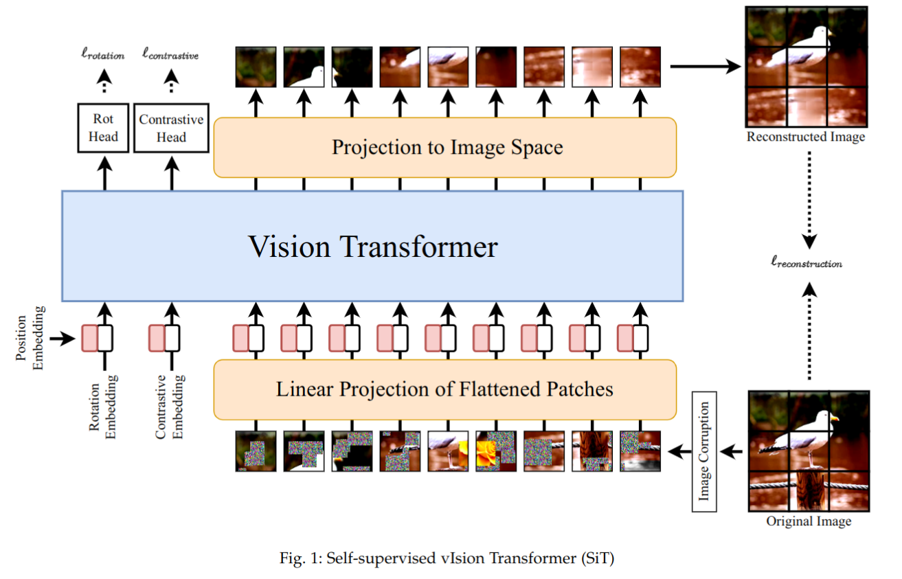

# SiT (Self-supervised vIsion Transformer) for Volumetric Medical Data

This project is an adaptation and training of the SiT model, originally developed by [Sara Atito, Muhammad Awais, and Josef Kittler](https://github.com/Sara-Ahmed/SiT). The original repository provides a foundation for this project, and we have made modifications to suit our specific needs.

Link to the original repository: [Original Repository](https://github.com/Sara-Ahmed/SiT)
</br>Link to the paper: [Paper](https://arxiv.org/abs/2104.03602)




# Requirements
- Create an environment
> conda create -n SiT python=3.8
- Activate the environment and install the necessary packages
> conda activate SiT

> conda install pytorch torchvision torchaudio cudatoolkit=11.0 -c pytorch

> pip install -r requirements.txt

# Steps to Run the Code

## Prepare the Data
Follow the steps below to successfully run the code in this repository:

- Download the data by referring to the instructions provided in the [`download_data.ipynb`](./download_data.ipynb) notebook.

    **Note:** To clean the file structure follow the steps in the next section (Clean File Structure).

- Convert the DICOM files into compressed NumPy arrays. There are two possible methods you can use:
  - **MeVisLab:** Using the [`network_final.mlab`](./network_final.mlab) in MeVisLab. Make sure to specify the output directory in the `RunPythonScript` module of the network.
  - **Python:** Run the [dicom_to_npz.py](./dicom_to_npz.py) file and make sure to specify the `clean_folder_dir`(directory containing the DICOM files in a clean structure.), and `output_dir` (directory where the output files will be saved). Optionally, you can specify the voxel size. The default value is 2,2,2.
    
    > python dicom_to_npz.py --root_dir /path/to/sorted_folder --output_dir /path/to/output_folder --voxel_size 2,2,2

## Prepare and conduct the actual training

- Obtain and set `Weights and Biases` API key
  - Create an account at wandb.ai
  - You'll find your API key in the start page (a kind of default readme)
  - Log into W&B through the command line (using wandb login --relogin), and provide the API key.
- Run the [`main_test.py`](./main_test.py) file and make sure to specify the 'data_location' argument.
  > python main_test.py --batch_size 16 --epochs 100 --data_location './data'

  **Note:** There are more arguments that can be specified!


# Clean File Structure
Follow the steps below to organize the flat list of DICOM files into the PatientID-StudyInstanceUID-SeriesInstanceUID-SOPInstanceUID hierarchy.

>git clone https://github.com/pieper/dicomsort.git

>pip install pydicom

>python dicomsort/dicomsort.py -u dicom_files_dir cohort_sorted/%PatientID/%StudyInstanceUID/%SeriesInstanceUID/%SOPInstanceUID.dcm


**Note:** Replace `dicom_files_dir` with the directory of saved dicom files.

# Reference


```
@article{atito2021sit,

  title={SiT: Self-supervised vIsion Transformer},

  author={Atito, Sara and Awais, Muhammad and Kittler, Josef},

  journal={arXiv preprint arXiv:2104.03602},

  year={2021}

}
```


